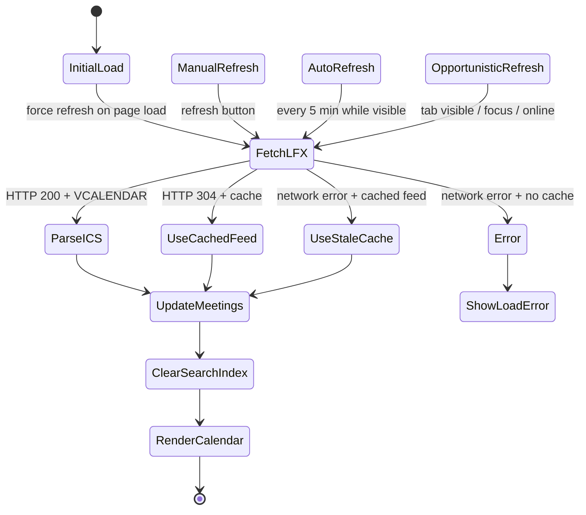

# LFX Sync State

The calendar reads the public LFX iCalendar feed directly in the browser.
LFX remains the source of truth; this app can force-refresh the endpoint, but
new or removed meetings only appear after LFX publishes them in the public ICS.

## Refresh Triggers

- Page load starts with a forced feed request.
- The refresh button always forces a feed request.
- While the page is visible, the app refreshes every five minutes.
- When the tab becomes visible, receives focus, or the browser comes back
  online, the app performs an opportunistic refresh with a short cooldown.

## Cache Behavior

- `sessionStorage` keeps the latest ICS text, ETag, and fetch timestamp.
- Non-forced requests can use the session cache inside the 15-minute TTL.
- Requests with a cached ETag use `If-None-Match`; a `304` updates the fetch
  timestamp without downloading the feed again.
- Forced refreshes use `cache: no-store` to bypass the browser cache.
- If the network fails but cached ICS exists, the calendar renders the cached
  meetings and marks the feed as stale.
- If the network fails before any cached feed exists, the app shows a load
  error.

## Update Pipeline

1. Fetch raw ICS from LFX.
2. Parse the feed into calendar events.
3. Compare feed text and event UIDs to produce the refresh notice.
4. Replace the in-memory event list.
5. Clear the cached occurrence search index.
6. Expand occurrences for the visible calendar range and render the view.
